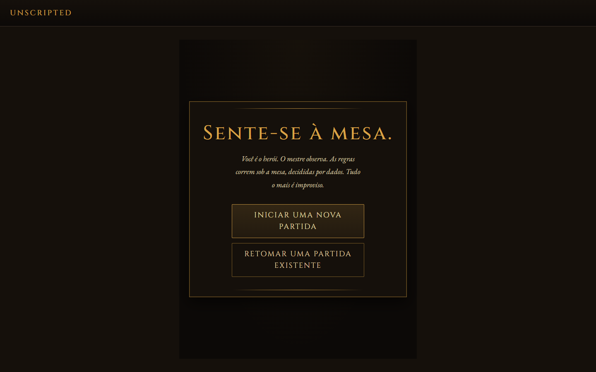
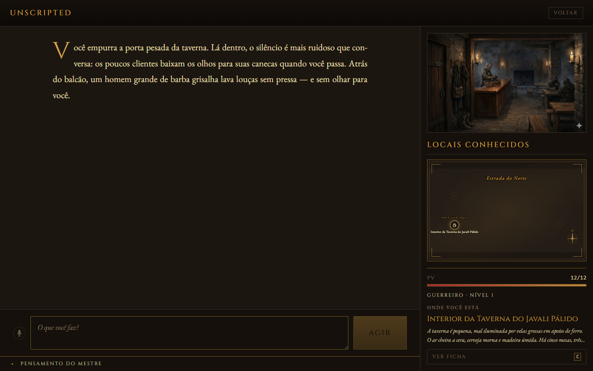
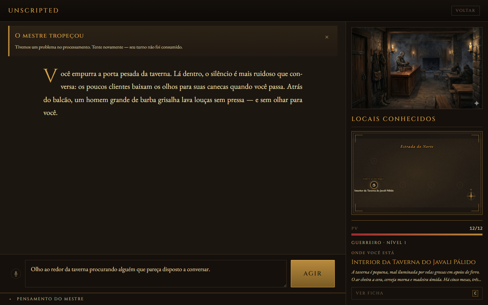

# Unscripted

> Single-player tabletop RPG with an AI Game Master.

The AI **narrates**, **arbitrates**, and **reacts** to anything the player tries — in natural language. Rules are enforced deterministically by a Python engine; the LLM handles interpretation, prose, and NPC voice. The interface is themed for tabletop play, not generic chat.

The game itself is played in **Portuguese (pt-BR)**; the i18n layer is in place for a second language in v2.



## The play view

Three zones: narration in the center, the scene image and the location graph on the right, and the player's sheet at the bottom-right. The "thought of the master" drawer at the bottom-left exposes the GM's reasoning — ruling, retrieved rules/lore, dice result, consequence applied, NPC reaction.



## How it works

**The deterministic / LLM boundary is the central thesis.** A turn flows through a Python orchestrator (`runner_turn.process_turn`) that intercalates LLM steps and deterministic steps:

1. **Robustness gate** — the player's input is validated by deterministic heuristics *before* any LLM is invoked. Result declaration, prompt injection attempts, and disallowed content are rejected with a red banner; the turn is not consumed.
2. **Referee agent** — a Gemini agent with a Pydantic `Ruling` schema decides if a roll is needed, which skill, the difficulty, and the consequences for success and failure.
3. **Dice** — deterministic Python rolls the die and compares against the difficulty.
4. **Consequence** — deterministic Python validates the LLM's proposal and applies it to the game state. The LLM never mutates state directly.
5. **Narrator agent** — turns the deterministic outcome into prose, streamed via SSE.
6. **NPC actor agent** — when a present NPC should react, voiced by a single agent with the persona injected from the chapter file.

**RAG for rules and lore.** Two corpora in pgvector: the SRD 5.1 fragments feed the Referee; the chapter file feeds the Narrator. Embeddings are computed locally (no API call per turn). Retrieval is a deterministic prefetch in the runner — not a tool the LLM chooses to call.

**The chapter file is the board.** Adventures are versioned YAML in `content/chapters/`. The engine has no story baked into it — it runs whatever is in that schema. Adding chapters or new stories is content work, not code work.

**Failures are non-destructive.** A timeout, an API quota, or a malformed LLM response surfaces as a banner with the player's text preserved in the input. The turn is not consumed, the state is intact.



## Project structure

```
unscripted/
├── backend/          # Python · FastAPI · Google ADK · Postgres+pgvector
│   └── app/
│       ├── agents/       # Referee, Narrator, NPCActor + robustness gate
│       ├── rules/        # dice, checks, consequences (deterministic)
│       ├── rag/          # chunking, embedding, vector store
│       ├── providers/    # LLM / embedding / voice (selectable by env)
│       └── runner_turn.py  # Python orchestrator (ADR-035)
├── frontend/         # React · Vite · TypeScript · CSS vanilla
├── content/
│   ├── srd/          # SRD 5.1 rules corpus (CC-BY 4.0)
│   ├── chapters/     # Original adventure chapters in structured YAML
│   └── characters/   # Pre-made player sheets (Guerreiro, Paladino)
├── docs/             # PRD, architecture, 43 ADRs, validation checklist
└── tests/
    ├── rules/        # Deterministic engine tests (100% coverage)
    ├── agents/       # Robustness contract tests
    ├── rag/          # Chunking + ingestion tests
    └── evals/        # Agent eval sets (opt-in, against real LLM)
```

## Run locally

The whole stack is portable via Docker Compose — same image runs locally and on a VPS, only env vars change.

```bash
cp .env.example .env
# Fill in GEMINI_API_KEY (https://aistudio.google.com/) and review other variables
docker compose up
```

- Backend: `http://localhost:8000` (FastAPI + SSE)
- Frontend: `http://localhost:5173`
- Postgres + pgvector: container `postgres` on `5432` (state, ADK sessions, embeddings — one instance for all three)

On first start the backend ingests `content/srd/` and `content/chapters/` into pgvector. Idempotent — re-running compares hashes and skips unchanged sources.

### Frontend dev (without Docker)

```bash
cd frontend
npm install
npm run dev        # http://localhost:5173
npm run lint
npm run typecheck
```

The Vite dev server proxies `/campaigns`, `/health`, and `/voice` to the backend. Set `BACKEND_URL` to point at a non-default backend.

### Running tests

```bash
pytest                 # 139 tests, ~6s, 100% coverage on the rules engine
pytest -m eval --no-cov   # eval sets against real Gemini (opt-in, costs API)
```

The default suite is free of API calls; eval sets are opt-in and skip automatically if `GEMINI_API_KEY` is missing.

## Architecture, decisions, validation

The design rationale is in the repo — these documents are part of the project, not auxiliary notes:

- **[docs/PRD.md](docs/PRD.md)** — what the system does and why
- **[docs/ARQUITETURA.md](docs/ARQUITETURA.md)** — how it's built
- **[docs/DECISOES.md](docs/DECISOES.md)** — 43 architectural decisions with context, alternatives, trade-offs
- **[docs/VALIDACAO_V1.md](docs/VALIDACAO_V1.md)** — point-by-point checklist of the v1 acceptance criteria

## Licensing

- **Code** — Apache 2.0 (see [`LICENSE`](LICENSE)). You can use, modify, and ship it, commercially or not.
- **Rules corpus** in `content/srd/` — derived from the **System Reference Document 5.1** by Wizards of the Coast LLC, licensed under **Creative Commons CC-BY-4.0**. Required attribution is in [`NOTICE`](NOTICE).
- **Adventure content** in `content/chapters/` — wholly original, written for this project. Not derived from any third-party module.

## Contributing

See [`CONTRIBUTING.md`](CONTRIBUTING.md). Pull requests welcome — open an issue first if it's a non-trivial change so we can align on direction.
